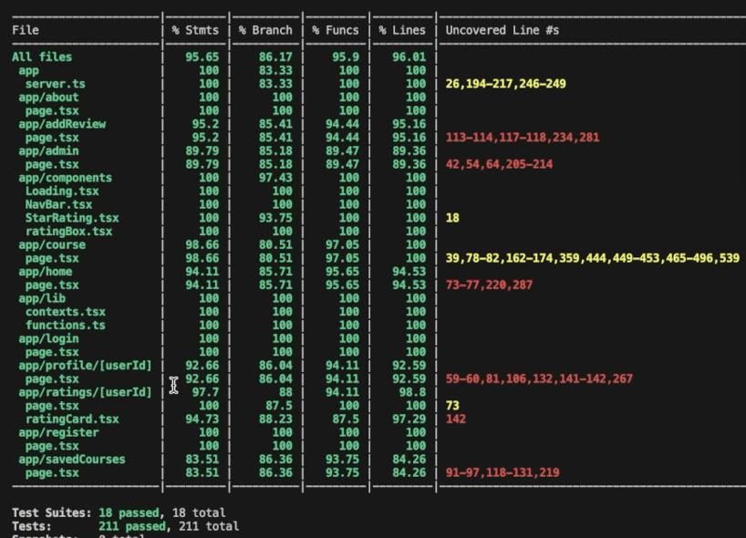

# Vandy Class Connect
https://vandy-class-connect-ls4a.vercel.app

## Starting the App:
1. npm install
2. npm run dev
3. Open: http://localhost:3000

## Run Course Scraper:
1. cd scraper
2. bun src/index.ts --function=courses 

**The course scraper is [scheduled](https://gitlab.com/ranadubauskas1/vandy-class-connect/-/pipeline_schedules) to run 2x a year before the start of each semester**

## Testing the Application:
### White Box Testing:
#### Framework:
- [Jest](https://jestjs.io/)
#### Commands:
1. npm run test
2. Coverage: npm run test:coverage

#### Demo:
https://github.com/user-attachments/assets/ed4db12e-c8ca-4c89-8321-ada239a2eed2
- [Video Link](https://vimeo.com/1032895311/3d18455398?share=copy)

### Black Box Testing:
#### Framework:
- [Cypress](https://www.cypress.io/app)
#### Commands:
1. npx cypress open
#### Demo:
- [Video Link](https://vimeo.com/1032893465/3742594b86?share=copy)

## About

Navigating course registration can be tough without enough information about content, workload, and professor expectations. Introducing Vandy Class Connect, the ultimate app for Vanderbilt students to make informed decisions about their classes. With Vandy Class Connect, you can share your own reviews and syllabi or access those shared by fellow students to make informed decisions about the best classes for your needs. Looking for additional support? Our app also connects you with course-specific tutors, giving you the personalized help you need to succeed.

## Framework

- [ReactJS](https://react.dev/)
- [NextJS](https://nextjs.org/docs)
- [Pocketbase DB](https://pocketbase.io/)
- [Tailwind CSS](https://tailwindcss.com/)

## Creators

- Rana Dubauskas - rana.s.dubauskas@vanderbilt.edu
- Anjali Kota - anjali.d.kota@vanderbilt.edu
- Ryan McCauley - ryan.e.mccauley@vanderbilt.edu 
- Steve Jung - steve.j.jung@vanderbilt.edu 

